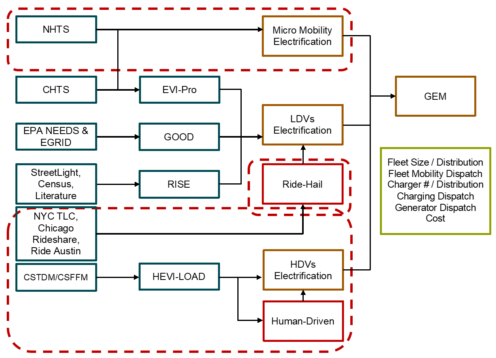

# Grid-integrated Electric Mobility model v2.0

## Project description

The Grid-integrated Electric Mobility (GEM) model is an open-source modeling platform developed by researchers at Lawrence Berkeley National Laboratory, UC Davis, and UC Berkeley. This modeling system simulates the operation of both the mobility sector and the electricity sector on a national scale in the United States. This GEM v2.0 is an extension of the original [GEM model](https://github.com/LBNL-UCB-STI/gem). This version now has the capability to study impact analysis of human-driven ride-hail, privately owned and SAEVs for LDVs, and human-driven, automated electrified trucks for HDVs, based on automation technologies and electrification on charging profiles and grid management (the extended capacities are circled with red dashline below).

## License

See the file LICENSE for the modified BSD license terms.

Copyright notice:

Grid-Integrated Electric Mobility Model (GEM) Copyright (c) 2021, The Regents of the University of California, through Lawrence Berkeley National Laboratory (subject to receipt of any required approvals from the U.S. Dept. of Energy) and University of California, Davis. All rights reserved.

If you have questions about your rights to use or distribute this software, please contact Berkeley Lab's Intellectual Property Office at IPO@lbl.gov.

NOTICE. This Software was developed under funding from the U.S. Department of Energy and the U.S. Government consequently retains certain rights. As such, the U.S. Government has been granted for itself and others acting on its behalf a paid-up, nonexclusive, irrevocable, worldwide license in the Software to reproduce, distribute copies to the public, prepare derivative works, and perform publicly and display publicly, and to permit others to do so.
